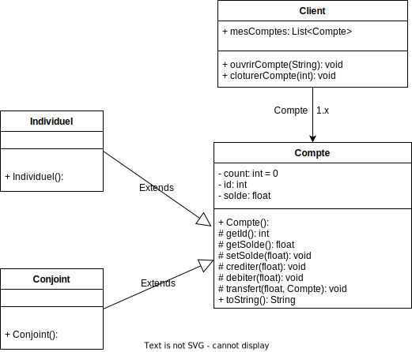

# Licence 2 Informatique - POO - TP8 - jeremy fouquet

# EXERCICE 1 - jeu de des

Questions :

1 Représenter le problème suivant sous forme de diagramme de classe   

2 Coder la classe Dés, classe possédant uniquement un attribut
indiquant la valeur de celui-ci, un constructeur, des getters et setters
ainsi qu'un toString.   

3 Coder la classe principale Jeu. Cette classe aura pour attribut : les 2 joueurs, la liste des dés ainsi qu'une variable indiquant le vainqueur. Du coté de ces méthodes, nous retrouverons toutes celles, permettant de gérer le déroulement du jeu ainsi que votre main.   

4 Coder la classe IA. L'IA possédera les mêmes attributs que le Player.
Au niveau de son fonctionnement à chaque tour, celui-ci lancera les 3
dés puis s'il possède d'autres lancers, il conservera le ou les plus
grands dés et relancera les dés les plus petits afin de toujours essayer
d'avoir 3 dés identiques.   

5 Coder la classe principale Jeu.
Cette classe aura pour attribut : les 2 joueurs, la liste des dés ainsi
qu'une variable indiquant le vainqueur. Du coté de ces méthodes,
nous retrouverons toutes celles, permettant de gérer le déroulement
du jeu ainsi que votre main.   

6 Qualifier à l'aide d'un commentaire dans la classe, la solution mise en
place pour l'IA, justifiez votre choix. Est-elle :    
* Fonctionnelle → Elle lui permet de gagner ou perdre, mais peut
        mieux faire. Ça marche mais, c'est brouillon ou mal fait.   
* Efficace → La solution est bonne et permet de résoudre le problème
        rapidement ou en utilisant peu de ressources. Ça marche, c'est pas
        mal mais, on peut l'améliorer.   
* Optimale → Cette solution est la meilleure possible ou tout autre
        solution est équivalente niveau complexité (temps / ressource).
        On ne peut pas faire mieux.   

7 Représenter votre code sous forme de diagramme de classe (histoire
qu'il puisse être comparé avec l'idée de base question 1)   

# EXERCICE 2 - combat de classe

Questions :

1 Représenter sous forme de diagramme de classe ce programme.  

2 Coder les classes Archer, Cavalier et Soldat, Player, IA, ainsi que la
classe principale Jeu.  

3 Coder une fonctionnalité de coup critique. Un coup critique
permettra d'ignorer l'action se protéger de l'adversaire et pourra être
réalisé par chaque personnage. Par défaut, la chance de critique sera
de 25% et doublera à chaque fois que l'adversaire se protège par
contre si l'adversaire réalise une attaque, ce pourcentage redescendra
à 25% (Ce qui veut dire que si l'adversaire se protège 2 fois de suite
la chance de coup critique au 3e tour sera alors de 100%)  

4 Représenter sous forme de diagramme de séquence le
fonctionnement de votre code.  

# EXERCICE 3 - Systeme bancaire

Question :

1 Représenter sous forme de diagramme de classe ce problème   

2 Coder les différentes fonctionnalités en utilisant de la POO   
Faites attention aux arnaques potentielles   

3 Dans votre main réaliser un jeu de test permettant de valider vos
différentes fonctionnalités. Pour rappel, un jeu de test ne doit pas
permettre à l'utilisateur de tester votre programme mais plutôt
montrer les différents cas que vous avez vous même testé. Pour
réaliser cela, vous êtes libre d'utiliser une technologie comme JUNIT
ou de les faire à la main dans votre main. Chaque test doit avoir un
commentaire précisant le cas à tester (cas normal ou particulier),
exécuter les méthodes nécessaires et afficher les résultats obtenus en
console.

# Auto-Évaluation :

Lisibilité du code : 1/1

Commentaire : 1/1

Modélisation : 1/2

* Pour le diagramme de séquence je pense qu'il n'est pas complet et qu'il manque des méthodes, des boucles et des conditions car je n'ai pas très bien appréhendé le concepte j'ai besoin d'encore un peu d'entrainement la dessus    

* Pour les diagrammes de classe je ne suis pas certain du sens des fleches de posséssion de classe (exemple le jeu possède le joueur : j'ai donc fait Joueur -> Jeu comme dans le cours, mais dans la video de l'atelier tu fait l'inverse il me semble, j'ai donc utilisé mon joker appel à un ami qui m'a dit "je ne met pas de fleche, seulement des traits ") ...? Donc j'ai fait comme dans le cours mais je ne suis pas certain de moi.

Pertinence des tests : 0,5/2

* Pour être honnete j'ai essayé de faire les tests en JUnit 5 (jupiter) mais je me suis mangé une erreur et par facilité j'ai opté pour suivre l'exemple donné sur le recap de l'atelier qui était en JUnit 3. Mais clairement ils ne couvrent que 34% du projet et il n'y aucun test sur cas posant probleme.

Ajout perso : 0/2 

* J'ai fait une surcharge de la methode equals() dans la classe Des pour Jeu de des mais je ne suis pas certain que l'on puisse parlé à juste titre d'ajout perso

Avancement du TP : 4/4

Bonne implémentation des concept vu en cours => 6/6

Bonne pratique : 2/2 

Mauvais pratique : -1/-2

* Le pseudo input select pour le choix entre humain ou IA n'est pas optimale il est possible de repondre "orange" et la reponse sera concidéré comme on oui pour le jeu de des.    

* Je ne gere pas les exeption pour les nextInt dans le cas où l'utilisateur tente de répondre par un autre type qu'un int

TOTAL : 14,5

# CORRECTION - EXERCICE 1

Alors voyons le dessin avant. Tu as un Jeu qui est un objet, ce jeu possède 2 player pouvant etre player ou IA (presence d'heritage) ainsi que 3 dés. L'archi globale semble pas mal. Le joueur a des fiches, le jeu les dés. Par contre pas besoin de repéter les attributs qui sont sur les flèches dans les classes. Après c'est dommage ta fais de l'heritage mais je vois playerOne / playerTwo tu devrais faire une liste c'est plus pratique. Après sur les flèche pas besoin de mettre les type met plutot le nom de tes variable. Dans ce cas la 2 flèches de Jeux vers player avec PlayerOne ecrit sur une et playerTwo sur l'autre.
Voyons le diagramme apres Bon bas meme remarque que le precedent après on voitr que la sctructure n'a pas changer ce qui est un bon signe.

Passons au code :
--Des
Bon alors la la classe est assez basique donc ca va après niveau commentaire ils sont quand même un peu bizarre. Ce que je peux te conseiller c'est soit tu commente que les methode spécifique soit le mieux c'est un commentaire par attribut de la classe + un par methodes en utilisant les annotation que tu as mise ce qui permet par la suite de faire de la doc auto.

--Player
Alors les attributs c'est ok, niveau commentaire meme remarque certain sont bizarre et n'apporte pas grand chose. Sinon je vois replayDes que tu as fais un choix par defaut en cas d'erreur très bonne initiative. Tu as aussi passer le scenner pour evité d'en créer un nouveau c'est pas mal. Après niveau scanner moi ce qu'on m'a dit c'est essayer de faire toutes les aisie dans le main au plus proche du user. Après certaine fois c'est compliquer et la je ne sais pas si le mieux c'est d'avoir un scanner publique ou en paramètre en tout cas ne pas en avoir un par classe c'est mieux. Par contre j'ai pas trop compris pourquoi avoir fait le traitement en 2 temps d'abord voir la length puis si c'est o pour oui. Pourquoi ne pas avoir fait directement
if(resp.equals("o")) -> techniquement si la saisie est vide alors c'est false (pas egale) car la au final tu recupere toute la saisie puis le premier caractère. Tu passe du String au char mais en soit tu peux aussi faire direct nextChar(). Après perso je conseil nextLine() on a moins de probleme avec le scanner.
Pour comparé les dés je vois que tu as fait un comparateur c'est un bon choix.
Et le reste est aussi clean et ok.

---IA--
Bon bas ici l'ia n'a pas de paramètre vu qu'il sont dans joueur c'est ok. Voyons sa methode perso. Ok donc tu as mis la methode en protected et tu l'a @verride pour l'ia en soit l'ia et le joueur on la même methode mais font pas pareil -> polymorphisme d'heritage c'est pas mal. Après pour l'ia il est pas vraiment efficace il est fonctionnel en gros sa marche mais c'est pas ouf. Il peux gagné ou perdre mais il n'essaye pas de maximiser son score s'il a par exemple un 2,2,6 il va relancer le 6 donc il joue la sécurité d'avoir le 2,2,2 mais ne prend pas en compte le lancer de l'autre joueur qui pourrais très bien avoir un 3,3,3. Donc oui sa repond au probleme mais ca s'arrète la. Pour que l'algo soit efficace il faudrait prendre au moins en compte le lancé du joueur precedent s'il existe et optimale qu'il y est des règle predefini pour maximise le score quelque soit le lancer.
Après petit detail -> essaye d'eviter d'avoir plusieurs return dans une même fonction c'est plus jolie d'en avoir un seul à la fin surtout quand tu peux l'eviter ;-)
Après petite precision sympa qui manque dans le commentaire j'imagine que la liste des dés est trié car tu compare jamais les 3 dés.
Sinon je reviens sur la remarque precedente essayer de faire ces saisie dans le main ici tu le remarque ta solution de passer le scanner en paramètre est pas terrible au final car elle t'oblige a avoir le même prototype pour le IA et avoir un scanner qui ne te sert a rien.

-- Jeu
Bon alors dans le projet il y a de l'héritage et un peux de polymorphsime même si c'est pas la best façon de faire (le coup du scanner). Je rappel que tout ces concept n'etait pas demandé dans ce TP ce qui fait un + majeur (soit tu connais java soit tu as lu les autre cours avant de faire le TP)
Mais ces dommage car ta pas poussé l'heritage au max -> pas de liste de player je suis un peu deçu après vu que c'etait pas demandé c'est pas grave.
D'ailleurs je viens de voir que ton Jeu est statique, c'est une solution après il serait plus interessant d'avoir un vrai objet pour les prochain TP histoire d'avoir la relation objet principal / sous objet.
Bon ici meme remarque choix du player / IA bonne idée de securisé la saisie avec valeur par defaut + pourquoi faire en 2 temps le traitement.
Sinon je remarque que ta utilise les concept de super Type pour ton IA je suis encore plus deçu xD
Ton IA est a la fois un IA + un player du coup tu pouvais mettre les 2 joueurs dans une collection commune et comme ta redefini la methode permettant de joueur java aurait gere lui même quoi faire selon si le player etait humain ou non.
En gros ta mis tout les concept de POO ta tout preparé mais ta pas conclus.
Pour la partie j'ai pas non plus compris pourquoi 2 boucle en soit elle ne sarrète pas au même moment ? Quand un des joueur a 0 fiche il a gagné. Du coup ya un vaicnqueur donc une des 2 boucle ne sert à rien. A ok en faite je dis de la merde pour toi le vainqueur c'est celui qui commence. Bon bas le nom est pas super bien choisi.
Ouai après il me semble que ta preciser mais sa manque d'optimisation justement par ce que tu as pas la liste des 2 players. Du coup si tu l'avais eu tu aurais pu dire pour chaque player faire ca et ca, au lieu du player 1 fait ca puis copier coller pour player 2. Sinon le code ca va.

Bon après niveau execution j'ai du mal avec le toString généré je trouve que c'est pas très visuel fin c'est dure a lire après le jeu marche bien.

# CORRECTION - EXERCICE 2

Commencons par le dessin.
Alors on va commencer par tes flèches deja pour les extends je comprend l'idée mais si je me trompe pas tu n'ai pas obliger de precisé (extends implement sur la flèche) en cas d'heritage juste faire une flèche suffit.
Pour savoir si ta fleche est a l'endroit il suffit de traduire en suivant la flèche par exemple ici tu as écris que IA est un Player. En soit sa semble juste après a voir dans le code.
Par contre pour les flèche de possesion la il faut laissé ce qu'il y a ecrit dessus c'est justement ce qui fait la differences entre les 2 type de flèche.

Sinon voyons l'architecture globale du programme: Il y a donc un Jeu qui possède 2 joueur pouvant etre des player ou des IA. Chacun d'eux possède un personnage qui peux etre un cavalier / soldat ou archer. Niveau architecture cela semble pas mal.
Il y a juste un truc qui me derange tu as utiliser de l'heritage mais pas au maxium des capacité. En gros je vois la double flèche de jeu à player autant faire une liste ou tableau de 2 ca fait qu'une flèche et c'est plus simple a les manipuler vu qu'il sont reuni au seins d'une même variable.
Sinon autre soucis sur les flèche tu as mis player au lieu du nom de tes variable par exemple j1 / j2
De plus sur tes flèche de possession il ne faut pas ecrire le type de la variable mais plutot son nom. Et du coup la retiré des variable de la classe vu que c'est indiquer sur la flèche. En gros playerOne / playerTwo devrait etre sur les flèches plutot que dans Jeu.

Passons à l'autre diagramme.
Alors niveau structure de bas on a bien le user aindi que tes classe Jeu / player / Personnage. Du coup tu as simplifier en ne mettant pas cavailer / soldat / archer / IA ok ca passe en soit ça aurait surcharger pour pas grand chose.
Sinon l'architecture semble pas mal on comprend les grande ligne du jeu et il y a bien les bloque pour les condition + boucle par contre j'ai pas encore vu le code et certain detail me font m'interroger.
Choix personnage c'est ok / Le mecanisme choisir joueur ou IA c'est ok
par contre la je vois pas pourquoi il y a competenceSpecial.
Puis apres coupCritique.
Avoir dans le code. Sinon petit detail comme je vois le return de personnage de (attaquer / seProteger / seSoigner) je sais pas si ta vraiment fait un retour ici mais tu peux faire des flèche pointiller sans valeur (quand c'est des void).

Bon maintenant voyons le code voir si sa reprend bien cette structure.

--Soldat / Archer / Cavalier--
Bon en soit la ya rien juste un constructeur pour creer le type. Par contre ta des commentaire non utilisé.

---Personnage--
Alors la pour les attributs c'est ok, pareil pour tout ce qui est constructeur / getter / setter.
Pour la competence special pas mal le switch case très bonne idée et du coup ici tu es aller chercher loin le nom de la classe en soit c'est pas bete non plus mais un attribut avec le nom dans les sous classe aurait pu etre plus simple. Après un petit detail je vois des setteur dans cette classe. Alors je vais clarifier un truc en soit sa marche mais tu en a pas besoin.
Quand tu es dans la classe de l'attributs tu peux faire this.attribut = valeur directement le setter c'est pour modifier sa valeur en sehors de sa classe genre a chaque tour quand l'adversaire va attaquer la faudra utiliser dans jeu setPv. Donc en soit pas besoin de se cassé la tête a faire ca. J'espère que l'explication est clair sinon n'hesite pas a me le signaler.
Pour critique bien pensé l'attribut du nombre de fois ou on c'est protege.
Meme remarque pour les setter utiliser dans : attaquer / seproteger ....

--IA
Pour l'ia c'est clean. Après la condition de ton while marche mais je pense qu'il y avait mieux car au final la ca va 3 possibilité mais si tu en a beaucoup pense a faire des intervalle tant que plus petit que ca ou plus grand que ca ou trouver une autre condition si c'est trop long.
Après ta toujours le même probleme evoquer plus tot du param scanner pour l'ia qui ne l'utilise pas qui est du au polymorphisme d'heritage que tu as mis en soit c'est mal pensé mais bien fait. Tu as pas bien reflechis ta mecanique d'ou le scanner mais tu l'as bien codé au bon endroit et c'est assez judicieux -> j'ai vu ca aussi dans l'exo precedent j'en tiendrais compte même si c'est pas bien fait après tout ca c'est suretout demander au 3e TP ici on est la pour travailler son objet donc les erreur polymorphisme et heritage que ta utilisé seront a corriger pour les prochain TP.

--Player
Bon bas player ca va.

---Jeu
Bon ici meme remarque que l'autre TP pour que ton polymorphisme d'heritage servent il te faut utiliser une liste pour tes player et y mettre ton player + ton IA qui a aussi le type player et ainsi realiser le même traitement que ce soit IA ou player java va gere solo ca evite les if player / ia IA.
Après comme dit precedement aussi ta classe continent que des methode staituqe en soit c'est ok mais n'hesite pas quand celle-ci a des attributs a en faire aussi un objet ;-)
comme ici ta 2 players donc tu peux y aller et comme ca sa fait des interractions objet sous objet. Après en soit c'est pas faux ta solution. D'ailleurs auand je parle d'attribut je parle d'objet que tu aurais créer si c'est des constante ou valeur quelconque tu peux faire une classe statique après ici c'est plus judicieux de creer un jeu comme ca tu peux avoir plusieurs jeu differents qui n'ont pas les même players.

Pour humainOrIA -> l'idee du while est bonne mais je conseil pour ce genre de cas la structure doWhile vu que tu repete tant que tu as pas la valeur attendu ce que tu fais mais avec un do while tu es obliger de passé dans le do au premier tour dans ce cas obliger de faire au moins une saisie en gros ta solution marche et elle est bien mais niveau syntaxe le do while serait encore plus beau. + Ta encore ta saisie en 2 temps même remarque que dans l'exo d'avant tu peux faire le nextLine et equals direct pas besoin de s'embete avec le charAt... Apres tu pouvais aussi considere tout reponse autre que o comme false.
Pareil pour addPlayer au lieu des instruction choissez un pseudo + la boucle while -> petit do while comme ca sa rassemble les 2 il choisi et si c'est pas le cas sa repete. En tout cas c'est typiquement le genre de boucle que tu fais avec execution minimal 1, donc le so while est la best option. La difference avec un while classique c'est que le while c'est possible de ne jamais y entré car la condition est fausse des le debut donc minimum 0 tour dans un do while on est obliger de faire le premier (minimal 1).
Ok pour choix perso et meme remarque de so while :9

Partie -> c'est la ou le polymorphisme pourrait intervenir en gros tu l'a coder mais pas utilisé. Ici tu pourrais coder un traitement unique pour un element de la liste et java l'adapterais auto si c'est un IA et non un pure player. Ce qui evite les playerOne.choix ....
Pour chaque player de la liste fait ca : .... (instructions) puis java se debrouille comme il fait le player ok c'est tel methode et le IA ok c'est @verride donc c'est ces instructions la pour lui. Je sais pas si c'est plus claire avec mon exemple en tout cas j'espère ^^'
Car au final dans les autre cas les 2 ne faisait pas la même chose hors ici oui donc sa t'oblige a copier coller les meme instruction en changeant juste la variable en info on aime copier coller mais pas quand c'est les meme instruction dans le même code pour ca qu'on a les boucle -> on appel ca redondance de code en gros c'est pas optimisé.

Sinon la partie est clean et du coup pour le diagramme de sequance tu as juste representer les grande ligne pas les sous methodes. C'est moins detailler après ca veux pas dire que c'est faux. Je fais la remarque car tu m'en a parler en commentaire en soit je pense ta compris l'idéeaprès parfois c'est chiant quand le programme est long.

Bon passons a l'execution alors ici une petite remarque que j'ai deja faite en gros j'imagine ta genere les toString mais ta le droit de les modifier ou de faire plusieurs fonction le truc de debug et le truc pour afficer ce qui est interessant a l'execution. En gros ici c'est un peux moche niveau lisibilité car la structure de base du toString c'est en mode deug avec les [] et tout.
Bon sinon en soit sa marche bien même si c'est moche.
Après feature perso le soin genere de la vie quand on est full xD

# CORRECTION - EXERCICE 3

Bon alors voyons ton dessin. Ok alors premier chose je m'attendais a voir un classe principale banque ou autre representant le systeme a modelisé, sinon ya bien client / compte. Par contre je comprend pas vraiment individuel / conjoint. En soit c'est en fonction du nombre de client a qui appartient le compte. A voir dans le code. En tout cas dans cette exo l'heritage etait pas demandé c'est dans le prochain donc tu avais pas besoin de t'embete après pour les prochains n'hesite pas a modeliser la classe qui represente le tout. Ici celle qui possède la liste de client, banque systeme banquaire....
Passons au code alors deja numero un ce que je peux te conseiller fait des package (dossier pour separe tes classe de tes test) après par contre faudra importé si les fichier sont pas dans le même package.

--Conjoint / Individuel--
Ici les classe sont vide du coup elles font offcice que de type ce que tu pouvais faire c'est utiliser une enumeration dans ce cas. A condition que ce soit pour identifier le type de compte (utiliser une enumeration qui fait office de constante). C'etait aussi valable dans l'autre exo c'est juste que je voulais que vous codiez les objets voir comment c'est mais en soit on aurait pu faire une enumeration dans ce cas aussi.

--Compte--
Comme precedement les getter et setter utilisé dans la classe elle meme.
Le transfert est astucieux c'est la technique que j'ai aussi mais c'est aps le cas de tout le monde. Mais la c'est bien pensé reutilisé ce que ta deja fais.
-> Sinon toujours certain commentaire bizarre mais a part ca cela semble pas mal.

--Client--
Pas de return dans les void sa fait bizarre. Ici tu aurait pu mettre ton autre type en tant que par defaut dans le else.
Bonne utilisation du while pour cloture un compte.
Par contre il manque des action comme le faite de pouvoir consulter un compte, pas de getter de sa liste de compte pour toString un compte ?
D'ailleurs je viens de remarquer mais ya un probleme tout est statique donc lcient n'est pas un objet ce qui sous entend qu'on peut pas le construire donc on en a que 1 et que tout les client on les même compte vu que c'est aussi statique pas vraiment optimal :-/

Après concernant les junit dommage que tu n'ai pas copier l'erreur sur le discord ou dans ton projet que je puisse voir de quoi il s'agit. Donc ici ce sont pas des test unitaire mais bien des situation donc jeu de test que tu as separé a voir ce que sa donne.
En soit chez moi les test marche.
Ouvrir compte c'est ok ta bien suivi le tuto.
Cloture ca marche aussi.
Crediter c'est ok. Après comme ta testé debiter et ton transfert c'est les 2 ta pas testé logique.
Par contre debiter il manque le cas ou tu debite une somme que tu as pas. Il se passe quoi dans ce cas la ? Tu as une dette ?
Ce qui se repercute aussi sur le transfert.
D'ailleurs la c'est pas super significatif mais on peut aussi tester le credit d'une somme negative voir si ya creation d'argent.
Alors petit retour sur les jeux de test ton Junit marche et c'est comme ca qu'on fait.
Et petite presicion sur les jeux de tests (que j'ai pas dit a l'atelier) il existe 2 types de tests:
Les test unitaire qui tester chacune de nos fonctionnalité -> celle ou ta la classe de test qui porte le nom d'une classe car sa test tout
Et le jeu de test qui a pour but de testé son application -> donc des scenario comme tu l'a fais mais non toutes les methodes existante.

# NOTE ET COMMENTAIRE FINAL TP8 :

C'est pas mal.
Niveau code tu code relativement bien, après attention au commentaire generé qui sont pas utilisé ca fait bizarre les annotation et tout vide. Après niveau annotation @params / @return tu devrais poussé un peux et precisé a quoi corresponde les variable car quand tu met son nom bas on le sais via le prototype mais on c'est pas forcement a quoi sa sert. Sinon les auytre commentaire sont bien.
Pour l'uml ta compris le principe et ya quelque detail a changé.
Pour les exception tu en a pas géré comme precisé c'etait pas obligatoire c'est considere comme un plus sauf si je le demande.
Après pour les concept de POO je pense que tu maitrise l'objet ta compris l'idée, après pour l'heritage et polymorphisme je pense aussi que ta compris a quoi sa sert par contre ici tu commence a avoir les base tu les as codé generalement correctement , au bon endroit mais pas bien utilisé par fois. Après pour ca je compte sur les autre TP pour t'aider a bien appréhender le tout.
Par contre il y a quelque probleme plutot niveau conception.
Alors deja attention entre ce qui est statique / non statique -> mon conseil si ta classe possede en attribut des objet que tu as créer fait aussi un objet.
N'hesite pas aussi a faire des objets globaux pour rassembler tes sous classe comme ici avec banque qui pourrait possédé plusieurs clients -> donc en ajouter / retire de sa liste.
Après ce que je peux te conseiller c'est de regarder le complement de comment modeliser un programme POO via un ennoncé ça pourrait t'aidé.
Et après en soit evite les classe vide -> utilise plutot des enumeration à la place.
Ici en soit pour le combat de classe c'est moi qui est demandé après elle etait vide car tu as utilisé de l'heritage ce qui n'etait pas demandé et si tu l'avais pas fait elle aurait ete pleine. En soit je voulais vous faire travailler les concept 1 par 1 mais dans ce cas tu as eu raison l'heritage etait clairement sous entendu. Par contre sa ta donné de mauvaise idée du coup pour l'exo final ou tu as créer des classe vidé en te basant sur l'exo precedent. Donc voila si la classe n'a aucun attribut et aucune methode (constructeur exclus) fait plutot une variable pour connaitre sa categorie un petit string / int ou dans certain cas une enumeration si c'est une constante pour differencier 2 variables.
En soit je crois que c'est tout Si ta des question n'hesite pas.

Lisibilité du code : 1/1
Commentaire : 1/1 -> commentaire bizarre a eviter sinon ca va
Modélisation : 1/2 -> ici ta compris l'idée mais attention a certain detail et surtout la reflexion en amont.

Pertinence des tests : 1/2 -> ta fais des test Junit après c'est pas hier complet il manque des test important et des fonctionnalité (donc des cas) comme le compte conjoint au final il existe pas vraiment donc on peut pas le tester au final le principe aurait plutot ete Alice et Bob on le meme compte donc si l'un fait un changement est ce que l'autre le vois.

Ajout perso : 1/2 -> il y a pas mal d'ajout pas d'exception dommage mais ya de l'heritage et polymorphisme meme si c'est pas très bien fait.

Avancement du TP : 4/4 -> tout a ete fait

Bonne implémentation des concept vu en cours => 4,5/6 -> ici il manque quelque fonctionnalité sous entendu au dernier exo peut etre mal comprise, attention au classe vide aussi et les retourne dans les void

Bonne pratique : 1/2 -> en soit j'ai vu les this et l'idee du scanner mais j'ai aussi vu la redondance de code bon la c'est les point de la perfection du code.

Mauvais pratique : 0/-2 -> rien vu ici je parle des concept interdit dans mon cours catch exception, return ou break de boucle...

14,5/20

-> c'est un bon TP en globalité premiere approche via mes retour tu devrais etre capable d'amelioré pas mal de petit truc et gagné plus de point sur les suivant. Continue comme ca et n'hesite pas a envoyer tes erreur sur le discord pour qu'on puisse t'aider. En soit de mon coté tout les test passait.

Du coup pour ton eval si je compte bien c'est pile la même note hazard ou tu tes bien estimé ? En tout cas tu regardera car c'est pas pour les mêmes critères. Exemple ajout ou tu avait mis 0 et je t'ai mis des points en tout cas. L'evaluation est exact xD

