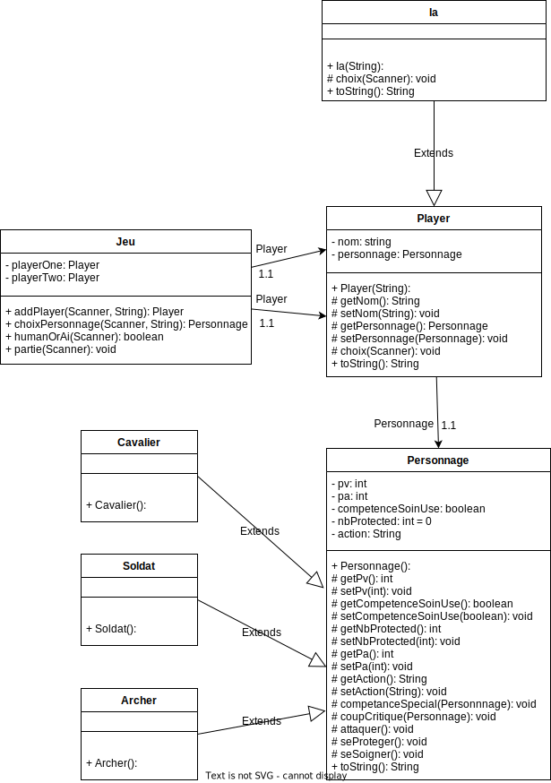
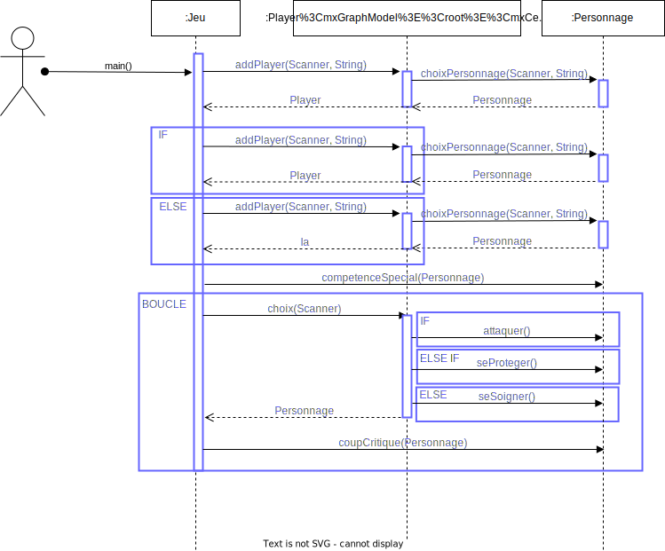

# combat_de_classe

Principe de base :  

Nous allons coder un autre petit jeu impliquant 2 joueurs (IA / Player).
Ce jeu utilisera 3 types de personnages différents : Archer, Cavalier et
Soldat en armure. Chaque personnage aura 5 points de vie, 1 point
d'attaque et pourra accomplir 3 types d'actions :  

• Attaquer (qui permettra d'infliger x dégâts à l'adversaire, dégâts
calculer en fonction des points d'attaques)  
• Se protéger (ce qui annulera tout dégât)  
• Se soigner (action spéciale utilisable qu'une seule fois permettant de
récupérer 2 points de vie)  
De plus, chaque personnage aura une compétence spéciale active tout au
long du jeu:  

• L'archer gagnera +1 d'attaque s'il est contre un cavalier.  
• Le cavalier lui aura +1 contre un soldat.  
• Le soldat le gagnera contre un archer.  

Déroulement du jeu :  

Au début du jeu chaque player va choisir une classe sans connaître celle de
l'adversaire. Une fois les choix effectués, la partie commence. À chaque
tour, on affiche au joueur la liste de ces possibilités. Le jeu prend fin quand
un des personnages perd tous ces points de vie.  
Questions : 

1. Représenter sous forme de diagramme de classe ce programme.  

2. Coder les classes Archer, Cavalier et Soldat, Player, IA, ainsi que la
classe principale Jeu.  

3. Coder une fonctionnalité de coup critique. Un coup critique
permettra d'ignorer l'action se protéger de l'adversaire et pourra être
réalisé par chaque personnage. Par défaut, la chance de critique sera
de 25% et doublera à chaque fois que l'adversaire se protège par
contre si l'adversaire réalise une attaque, ce pourcentage redescendra
à 25% (Ce qui veut dire que si l'adversaire se protège 2 fois de suite
la chance de coup critique au 3e tour sera alors de 100%)  

4. Représenter sous forme de diagramme de séquence le
fonctionnement de votre code.  

