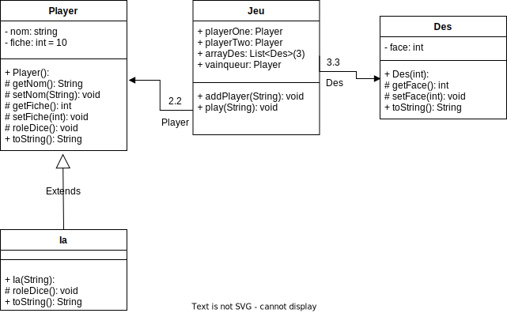
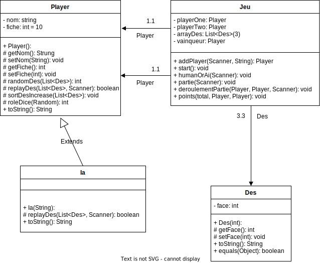

# jeu_de_des

Principe de base :

Dans cet exercice, nous allons créer un jeu de dés qui opposera 2 joueurs
(IA ou Player). Pour cela, nous aurons besoin de 3 dés. Le but du jeu est
simple, chaque joueur à 10 fiches et le premier à s'en débarrasser a gagné.
La première chose à faire sera de demander le nom de l'utilisateur 1, puis
de lui proposer si celui-ci veut jouer contre un IA ou un autre Player.
S'il choisit de jouer contre un autre player, l'utilisateur 2 saisira à son tour
son nom.

Déroulement de la partie :

Pour commencer, les 2 joueurs vont lancer les 3 dés. Celui ayant fait le
plus grand score, c’est-à-dire assembler les chiffres de chaque dé de sorte à
former le nombre le plus grand,sera le joueur qui commencera la partie. À
chaque tour de jeu, le joueur qui a la main aura 3 lancers. Il commencera
par lancer les 3 dés, puis il pourra soit décider de passer la main à l'autre
joueur, soit de relancer les dés voulus (1 dé, 2 dés ou les 3). Petite
particularité, si le premier joueur ne lance les dés qu'une seule fois, le 2e
n'aura le droit qu'à 1 lancé.

Le but sera donc de réaliser une combinaison plus grande que son
adversaire ou une des combinaisons spéciales. Une combinaison spéciale
est indiquée par 3 dés identiques. Contrairement à une combinaison
quelconque qui permettra de donner une seule fiche à son adversaire, pour
une combinaison spéciale, le nombre de fiches sera équivalent au nombre
représenté par les 3 dés à savoir de 1 à 6.

Voici donc les combinaisons gagnantes classées de la plus forte à la plus faible :

6,6,6  
5,5,5  
4,4,4  
3,3,3  
2,2,2  
1,1,1

Les autres combinaisons ordonnées de la plus grande sommes à la plus
petite.

Questions :  

1. Représenter le problème suivant sous forme de diagramme de classe   

2. Coder la classe Dés, classe possédant uniquement un attribut
indiquant la valeur de celui-ci, un constructeur, des getters et setters
ainsi qu'un toString.   

4. Coder la classe IA. L'IA possédera les mêmes attributs que le Player.
Au niveau de son fonctionnement à chaque tour, celui-ci lancera les 3
dés puis s'il possède d'autres lancers, il conservera le ou les plus
grands dés et relancera les dés les plus petits afin de toujours essayer
d'avoir 3 dés identiques.   

5. Coder la classe principale Jeu.
Cette classe aura pour attribut : les 2 joueurs, la liste des dés ainsi
qu'une variable indiquant le vainqueur. Du coté de ces méthodes,
nous retrouverons toutes celles, permettant de gérer le déroulement
du jeu ainsi que votre main.   

6. Qualifier à l'aide d'un commentaire dans la classe, la solution mise en
place pour l'IA, justifiez votre choix. Est-elle :    
    • Fonctionnelle → Elle lui permet de gagner ou perdre, mais peut
        mieux faire. Ça marche mais, c'est brouillon ou mal fait.   
    • Efficace → La solution est bonne et permet de résoudre le problème
        rapidement ou en utilisant peu de ressources. Ça marche, c'est pas
        mal mais, on peut l'améliorer.   
    • Optimale → Cette solution est la meilleure possible ou tout autre
        solution est équivalente niveau complexité (temps / ressource).
        On ne peut pas faire mieux.   

7. Représenter votre code sous forme de diagramme de classe (histoire
qu'il puisse être comparé avec l'idée de base question 1)   

