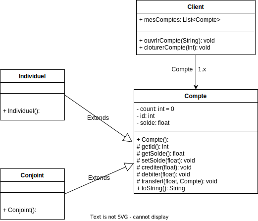

# Systeme_bancaire
 
Présentation :   

Dans cet exercice, nous allons modéliser un système bancaire dans lequel
des clients pourront ouvrir ou clôturer des comptes qu'ils soient individuels
ou conjoints (partagé par 2 personnes). Sur chaque compte, un client
pourra créditer de l'argent (déposer) ou en débiter (retirer) voir réaliser des transferts d'un compte à un autre.  

Question :  

1. Représenter sous forme de diagramme de classe ce problème   

2. Coder les différentes fonctionnalités en utilisant de la POO   
Faites attention aux arnaques potentielles   

3. Dans votre main réaliser un jeu de test permettant de valider vos
différentes fonctionnalités. Pour rappel, un jeu de test ne doit pas
permettre à l'utilisateur de tester votre programme mais plutôt
montrer les différents cas que vous avez vous même testé. Pour
réaliser cela, vous êtes libre d'utiliser une technologie comme JUNIT
ou de les faire à la main dans votre main. Chaque test doit avoir un
commentaire précisant le cas à tester (cas normal ou particulier),
exécuter les méthodes nécessaires et afficher les résultats obtenus en
console.  

Exemple de test :  

Test de la fonction créditer  

* Création d'un compte   
* Affichage du solde   
* Affichage d'un message expliquant le test   
* Appel de la méthode créditer   
* Affichage du solde du compte  

Code du test (réalisé à la main dans le main) :  

// Test de la méthode créditer (Cas normal)

> Compte compteTest = new Compte("TOTO");  
> System.out.printf("Solde actuel %f", compteTest.getSolde());  
> System.out.printf("Ajout de 50€ sur le compte TOTO");  
> compteTest.crediter(50);  
> System.out.printf("Solde actuel %f", compteTest.getSolde());

